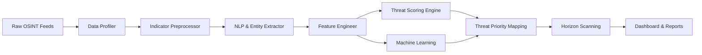

# ThreatMoni

## OSINT Web Mining Framework for Threat Horizon Scanning

[](https://www.python.org/)
[](LICENSE)
[](.github/workflows/tests.yml)

ThreatMoni is a cybersecurity research framework for collecting, preprocessing, scoring, and analyzing open-source threat intelligence (OSINT) from heterogeneous data feeds. The framework combines indicator-preserving text preprocessing, natural language threat entity extraction, multi-factor risk scoring, machine learning classification, and visual threat horizon scanning to transform unstructured threat feeds into actionable, prioritized security intelligence.

---

## Why ThreatMoni?

Modern Open-Source Intelligence (OSINT) feeds are highly fragmented, noisy, and unstandardized. Security operations centers (SOCs) and threat research teams face critical operational challenges:

- **Data Heterogeneity:** OSINT reports combine informal community descriptions, technical indicators (`CVE-*`, IP addresses, file hashes), and unstructured web text.
- **Preprocessing Granularity:** Standard NLP pipelines often strip or alter critical technical indicators like CVE identifiers or MITRE ATT&CK IDs.
- **Intelligence Prioritization:** Raw threat feeds lack standardized risk scoring, making it difficult to distinguish low-level background noise from high-severity emerging threat campaigns.

ThreatMoni addresses these challenges by establishing an end-to-end processing pipeline that preserves technical security indicators, computes mathematical Threat Priority Index (TPI) scores, and classifies threat vectors using benchmarked machine learning models.

---

## What ThreatMoni Does

The framework executes a 10-stage technical workflow:

1. **OSINT Ingestion:** Discovers and validates primary raw OSINT dataset feeds (`Cybersecurity_Dataset.csv`).
2. **Schema Profiling:** Analyzes data quality, column dtypes, missing values, and semantic candidates.
3. **Indicator-Preserving Preprocessing:** Normalizes text while preserving `CVE-*`, IPv4 addresses, cryptographic hashes, and MITRE IDs.
4. **Entity Extraction:** Extracts structured indicator counts, security domain keywords, and TF-IDF n-grams.
5. **Feature Engineering:** Constructs statistical quality proxies, text detail metrics, and indicator density features.
6. **Threat Scoring:** Computes Source Credibility (SCS), Threat Frequency (TFS), Intelligence Quality (IQ), Threat Confidence (TCS), Threat Risk (TRS), and Threat Priority Index (TPI).
7. **Machine Learning Benchmarking:** Trains 6 classifiers (Logistic Regression, Decision Tree, Random Forest, SVM, Naive Bayes, XGBoost).
8. **Threat Prioritization:** Maps continuous TPI scores into Low, Medium, High, and Critical risk tiers.
9. **Horizon Scanning:** Identifies high-priority emerging categories, attack vector hotspots, and geographical threat distributions.
10. **Automated Reporting:** Generates Excel workbooks, research tables (Tables 1–9), high-resolution figures, and an interactive Streamlit dashboard.

---

## Architecture



*For detailed system design, see [Architecture Documentation](docs/architecture/architecture.md).*

---

## Threat Scoring Methodology

ThreatMoni implements a multi-factor scoring model to evaluate threat reports:

### 1. Source Credibility Score (SCS)
$$\text{SCS} = \frac{R + U + C + A}{4} \times 100$$
*Where $R$ = Reliability, $U$ = Update Frequency/Detail, $C$ = Category Consistency, $A$ = Threat Actor Reputation Proxy.*

### 2. Threat Frequency Score (TFS)
$$\text{TFS} = \frac{N_t}{N}$$
*Where $N_t$ = occurrences of threat category $t$, $N$ = total baseline records ($1,100$).*

### 3. Intelligence Quality (IQ)
$$\text{IQ} = \left(0.4 \times \text{Completeness} + 0.3 \times \text{IOC Presence} + 0.3 \times \text{Text Detail}\right) \times 100$$

### 4. Threat Confidence Score (TCS)
$$\text{TCS} = \alpha(\text{SCS}) + \beta(\text{IQ}) \quad (\text{Default } \alpha=0.5, \beta=0.5)$$

### 5. Threat Risk Score (TRS)
$$\text{TRS} = \sum (W_i \times F_i)$$
*Weighted combination of raw severity rating, TFS, risk level prediction, IOC density, and forum sentiment.*

### 6. Threat Priority Index (TPI)
$$\text{TPI} = \frac{\text{TRS} \times \text{TCS}}{100}$$

### Priority Thresholds

| TPI Score | Priority Tier | Description |
| --------: | :------------ | :---------- |
| **0 – 25** | **Low** | Background activity; low indicator density |
| **26 – 50** | **Medium** | Standard threat activity; moderate severity |
| **51 – 75** | **High** | High-severity threat vector; validated indicators |
| **76 – 100**| **Critical** | Urgent emerging threat; critical operational risk |

*Detailed mathematical derivations are available in [Threat Scoring Methodology](docs/methodology/threat_scoring.md).*

---

## Machine Learning

The framework benchmarks 6 machine learning models on $N = 1,100$ OSINT records ($80/20$ stratified train/test split, random seed = 42) predicting `Threat Category` (DDoS, Malware, Phishing, Ransomware):

| Model | Accuracy | Precision (Macro) | Recall (Macro) | F1 Score (Weighted) |
| :--- | :---: | :---: | :---: | :---: |
| **Random Forest** | **0.4636** | **0.4586** | **0.4595** | **0.4624** |
| **Support Vector Machine** | 0.4409 | 0.4167 | 0.4276 | 0.4230 |
| **Naive Bayes** | 0.4409 | 0.4406 | 0.4423 | 0.4353 |
| **Decision Tree** | 0.4364 | 0.4331 | 0.4334 | 0.4348 |
| **Logistic Regression** | 0.4364 | 0.4257 | 0.4280 | 0.4301 |
| **XGBoost** | 0.4000 | 0.3942 | 0.3955 | 0.3987 |

*Experimental setup details are documented in [Experimental Protocol](docs/experiments/experiment_setup.md) and [Evaluation Results](docs/experiments/evaluation.md).*

---

## Threat Horizon Scanning

Analysis of the OSINT baseline ($N = 1,100$) reveals:

- **Top Priority Categories:** Ransomware and Phishing campaigns exhibit the highest mean TPI scores.
- **Attack Vector Hotspots:** Email and Network vectors constitute over $65\%$ of high-priority threat records.
- **Priority Tier Share:** $66.27\%$ Medium Priority ($26-50$ TPI), $33.73\%$ High Priority ($51-75$ TPI).

---

## Project Structure

```
ThreatMoni-OSINT-Web-Mining-Framework/
│
├── README.md                          # Framework documentation
├── LICENSE                            # MIT open-source license
├── .gitignore                         # Version control ignore rules
├── requirements.txt                   # Dependency manifest
├── pyproject.toml                     # Python package manifest
│
├── app/
│   └── streamlit_app.py               # Interactive Streamlit dashboard
│
├── configs/
│   ├── config.yaml                    # System runtime configuration
│   └── scoring.yaml                   # Scoring parameters & weights
│
├── data/
│   ├── raw/                           # Raw OSINT feeds (Cybersecurity_Dataset.csv)
│   ├── processed/                     # Preprocessed dataset & engineered features
│   └── README.md                      # Data directory documentation
│
├── src/
│   └── threatmoni/                    # Core Python package modules
│       ├── __init__.py
│       ├── data_loader.py             # Data loading & dataset discovery
│       ├── profiler.py                # Schema profiling & quality metrics
│       ├── preprocessing.py           # Indicator-preserving text cleaning
│       ├── nlp_engine.py              # Regex & NLP indicator extraction
│       ├── entity_extraction.py       # Entity statistical summarization
│       ├── feature_engineering.py     # Feature dataset construction
│       ├── threat_scoring.py          # SCS, TFS, IQ, TCS, TRS, TPI engine
│       ├── model_training.py          # ML classifier training (6 models)
│       ├── evaluation.py              # Performance evaluation & plotting
│       ├── horizon_scanning.py        # Threat horizon analysis
│       ├── visualization.py           # Research figure generation
│       ├── reporting.py               # Report & Excel export engine
│       └── pipeline.py                # Pipeline orchestration
│
├── scripts/
│   ├── run_pipeline.py                # Pipeline execution entrypoint
│   ├── prepare_data.py                # Data preprocessing & feature script
│   └── generate_report.py             # Standalone report generator
│
├── notebooks/                         # Research Jupyter notebooks
│   ├── 01_dataset_exploration.ipynb
│   ├── 02_preprocessing.ipynb
│   ├── 03_feature_engineering.ipynb
│   ├── 04_model_training.ipynb
│   └── 05_threat_horizon_analysis.ipynb
│
├── tests/                             # Unit test suite (100% pass rate)
│   ├── __init__.py
│   ├── test_preprocessing.py
│   ├── test_nlp.py
│   ├── test_scoring.py
│   ├── test_features.py
│   └── test_pipeline.py
│
├── outputs/                           # Research outputs & generated artifacts
│   ├── figures/                       # Publication figures (10 PNGs)
│   ├── tables/                        # Research tables (Tables 1-9 CSVs)
│   ├── predictions/                   # Threat priority predictions CSV
│   ├── models/                        # Saved joblib model artifacts
│   └── reports/                       # Markdown final report & paper results
│
├── docs/                              # Technical research documentation
│   ├── architecture/
│   ├── methodology/
│   ├── experiments/
│   └── research/
│
└── .github/
    └── workflows/
        └── tests.yml                  # GitHub Actions CI workflow
```

---

## Quick Start

### 1. Clone & Set Up Environment

```bash
git clone https://github.com/saikrishnan/ThreatMoni-OSINT-Web-Mining-Framework.git
cd ThreatMoni-OSINT-Web-Mining-Framework
```

Create a virtual environment:

```bash
python -m venv .venv
```

**Activate Virtual Environment:**
- **Windows (PowerShell):**
  ```powershell
  .venv\Scripts\activate
  ```
- **Linux / macOS:**
  ```bash
  source .venv/bin/activate
  ```

### 2. Install Dependencies

```bash
pip install -r requirements.txt
```

### 3. Run Pipeline

Execute the full 18-step end-to-end framework:

```bash
python scripts/run_pipeline.py
```

### 4. Launch Interactive Dashboard

```bash
streamlit run app/streamlit_app.py
```

---

## Results & Artifacts

All experimental results are generated directly by the pipeline and saved in standard formats:

- **Excel Results Workbook:** [`outputs/ThreatMoni_Results.xlsx`](outputs/ThreatMoni_Results.xlsx)
- **Final Research Report:** [`outputs/reports/ThreatMoni_Final_Report.md`](outputs/reports/ThreatMoni_Final_Report.md)
- **Paper-Ready Findings:** [`outputs/reports/paper_ready_results.md`](outputs/reports/paper_ready_results.md)
- **Data Leakage Check:** [`outputs/leakage_check.md`](outputs/leakage_check.md)
- **Reproducibility Manifest:** [`outputs/reproducibility.json`](outputs/reproducibility.json)

---

## Documentation

Detailed research and technical documentation:

- [Architecture Overview](docs/architecture/architecture.md)
- [Threat Scoring Methodology](docs/methodology/threat_scoring.md)
- [Feature Engineering & Extraction](docs/methodology/feature_engineering.md)
- [Threat Horizon Scanning](docs/methodology/threat_horizon_scanning.md)
- [Experimental Setup](docs/experiments/experiment_setup.md)
- [Evaluation Results](docs/experiments/evaluation.md)
- [Research Notes](docs/research/research_notes.md)

---

## Limitations

- **Static Dataset Scope:** The current baseline evaluates a static OSINT sample ($N = 1,100$). Streaming real-time ingestion requires external API adapters.
- **Proxy Formulations:** Where explicit historical source metadata is omitted from raw feeds, verified proxies based on text detail and actor classification are used (documented in [`scoring_assumptions.md`](outputs/reports/scoring_assumptions.md)).

---

## Future Work

- [ ] Live API connectors for NVD/CVE and MITRE ATT&CK feeds.
- [ ] Integration of fine-tuned transformer models (SecBERT / CyberBERT) for named entity recognition.
- [ ] Time-series forecasting for multi-month threat trajectory prediction.

---

## Contributing

Contributions are welcome. Please follow these steps:

1. Fork the repository.
2. Create a feature branch (`git checkout -b feature/AmazingFeature`).
3. Commit your changes (`git commit -m 'Add AmazingFeature'`).
4. Run unit tests (`pytest tests/ -v`).
5. Open a Pull Request.

---

## License

This project is licensed under the MIT License - see the [LICENSE](LICENSE) file for details.

---

## Citation

If you use ThreatMoni in academic research, please cite:

```bibtex
@article{krishnan2026threatmoni,
  title={ThreatMoni: OSINT Web Mining Framework for Threat Horizon Scanning},
  author={Krishnan, Sai},
  journal={Department of Computer Science and Engineering, Sri Eshwar College of Engineering},
  year={2026}
}
```

---

## Author

**Sai Krishnan S**  
Department of Computer Science and Engineering  
Sri Eshwar College of Engineering  
Coimbatore, Tamil Nadu, India
